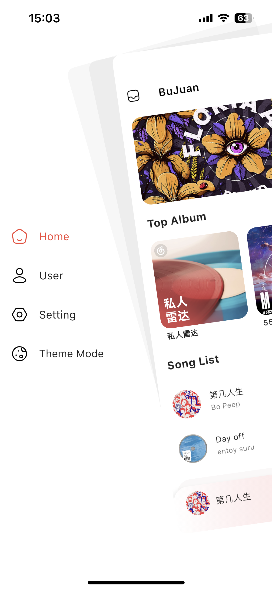

<h1 align="center">bujuan</h1>

一个支持Android、iOS、MacOS、Windows、Linux的三方网易云播放器。

#### MacOS 

#### Android & IOS

|  |  |  |
|----------------------------------------------------------|----------------------------------------------------------|----------------------------------------------------------|

## 功能介绍
- 采用flutter开发，可打包编译为所有平台。

- 网易云账号登录（手机号、二维码）。

- 每日推荐、私人Fm、电台、云盘。

- 歌手、专辑、搜索

- 去除无用功能，专注于用户音乐。

### 代码部署编译
- `flutter pub get`
- `flutter build apk --release`
- `flutter build ios`
- `flutter build macos`
